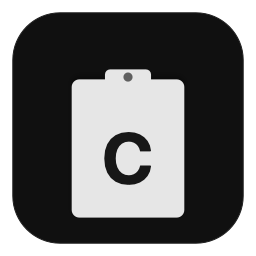

<p align="center">
  
</p>

<h1 align="center">Copyaster</h1>

<p align="center">
  <strong>Clipboard manager para macOS. Minimal, rápido, siempre ahí.</strong>
</p>

<p align="center">
  <a href="https://github.com/whoismodder/copyaster/releases/latest"></a>
  <a href="https://github.com/whoismodder/copyaster/blob/main/LICENSE"></a>
  
  
  <a href="https://github.com/whoismodder/copyaster/releases/latest"></a>
</p>

---

## Instalación

```bash
brew tap whoismodder/copyaster
brew install --cask copyaster
```

O [descargá el DMG](https://github.com/whoismodder/copyaster/releases/latest) → arrastrá a Aplicaciones.

> Si macOS dice "dañado": `xattr -cr /Applications/Copyaster.app`

## Qué hace

Copyaster vive en tu menu bar. Cada vez que copiás algo, lo guarda. Vos elegís qué necesitás, cuando lo necesitás.

**Dos capas:**
- **Recientes** — últimos 20 clips, se gestionan solos
- **Guardados** — clips persistentes con emoji + título

## Features

- 📋 **Menu bar** — siempre a un click
- ⌨️ **⌘⇧V en cualquier lugar** — selector inline en cualquier campo de texto
- 🏷️ **Guardá con emoji + título** — organizá lo importante
- 🔍 **Búsqueda** — encontrá clips al instante
- 📲 **Universal Clipboard** — detecta lo que copiás desde el iPhone
- 📒 **Apple Notes** — enviá clips a Notas con un click
- 👀 **Hover preview** — ve tu clipboard sin hacer click
- 🔒 **Seguro** — nunca guarda passwords ni datos sensibles
- ⌘ **Multi-select** — seleccioná varios clips con ⌘+click
- ⚙️ **Configurable** — cambiá el atajo, arranque automático
- 🪶 **1.5MB** — Swift nativo, sin Electron, sin peso

## Atajos

| Tecla | Acción |
|-------|--------|
| Click en 📋 | Abrir panel |
| Hover en 📋 | Preview del clip actual |
| ⌘⇧V | Selector inline |
| ↑↓ | Navegar clips |
| ⏎ | Copiar al clipboard |
| ⌘+click | Seleccionar varios |
| ⇥ | Cambiar Recientes / Guardados |
| Esc | Cerrar |
| Click derecho 📋 | Ajustes / Salir |

## Compilar desde el código

```bash
git clone https://github.com/whoismodder/copyaster.git
cd copyaster
make icons  # generar ícono
make run    # compilar y abrir
```

Requiere macOS 14+ y Xcode Command Line Tools (`xcode-select --install`).

## Stack

- Swift 5.9 + SwiftUI + AppKit
- Carbon Events para hotkeys globales (sin permisos de accesibilidad)
- Almacenamiento JSON local
- Cero dependencias — solo frameworks del sistema

## Licencia

[MIT](LICENSE) — usalo como quieras.
